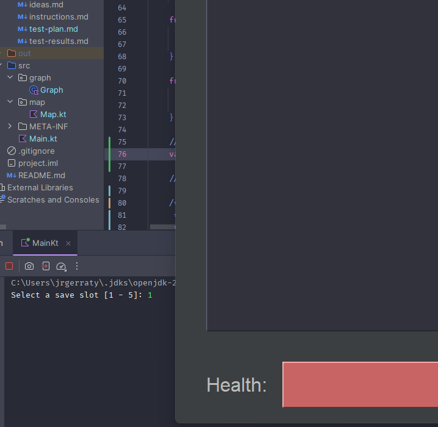
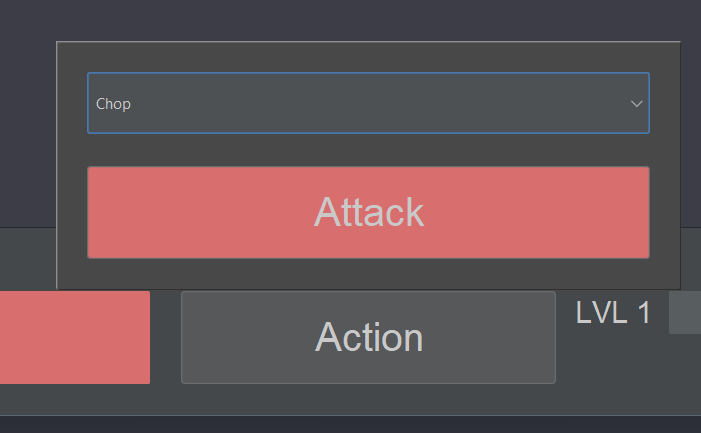
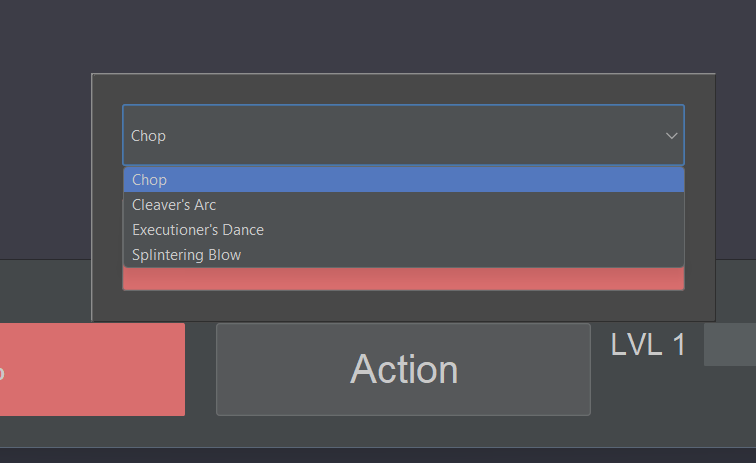
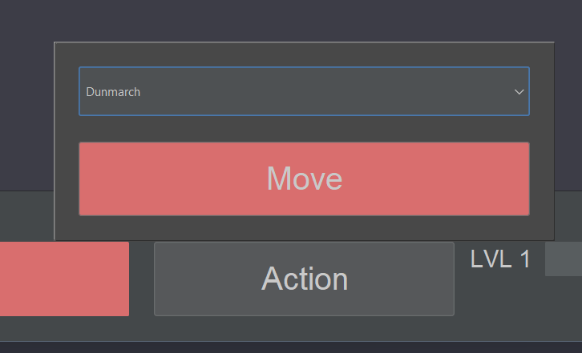
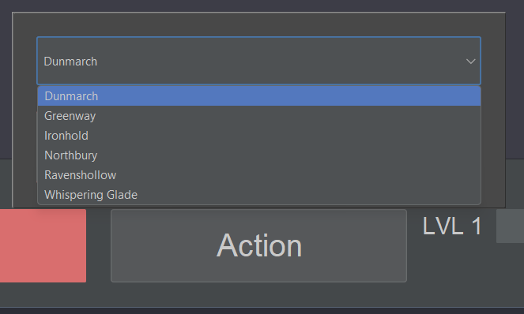
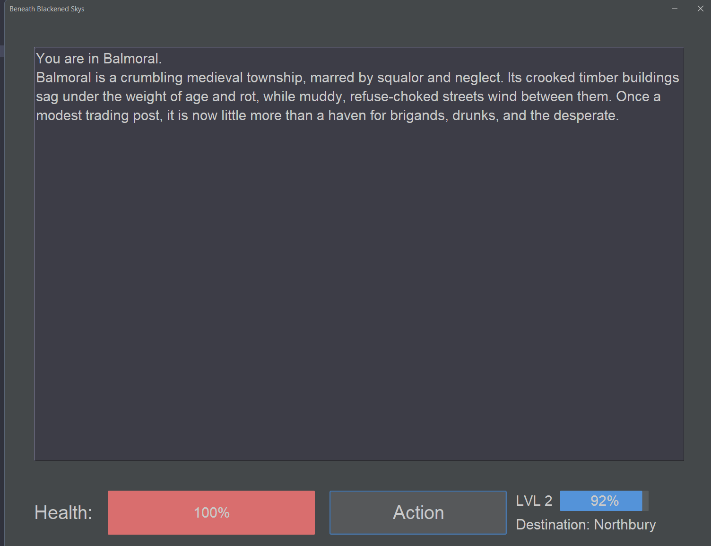

# Development Log

The development log captures key moments in your application development:

- **Design ideas / notes** for features, UI, etc.
- **Key features** completed and working
- **Interesting bugs** and how you overcame them
- **Significant changes** to your design
- Etc.

---

## Date: prior to 1/04/25

(I was given this template late)

I decided to use an undirected graph to represent the games map, as gives a convenient way to represent the connections
to other places.

I also created a health bar, as I knew I wanted my theme to be some kind of text-based RPG

---

## Date: 1/04/25

Since we are using a graph to store the map, I had the idea to allow the player to ask NPCs for directions to other far
locations.

I went for a medieval theme, for simplicity

---

## Date: 2/04/25

I completed the pathfinding implementation using a breadth first search.

The game now asks for a save slot in the console before launching the gui. I may move this into the gui later.

---

## Date: 28/04/25

Giving up on data saving. I want the game to be shorter and more linear so it's easier to test.  
Added sublocations, for things like stores in towns.  
Added an onboarding quest as a sort of tutorial and to get you into the story.  
This includes a text input you can use to give yourself a name.  
Got combat mostly working, with a simple attack selector.

---

## Date: 29/04/25

Implemented the Weapon class in the Dictionary object, which will store all weapons or other kinds of items you will
collect.  
Got the movement system working so you can visit neighbouring locations while outside of a sequence. Lets you move
between sublocations too.

---

## Date: 30/04/25

Decided to remove sublocations. The shop idea wasn't going to work, and I ran out of room to put a gold counter in the
UI.  
Finished the UI by adding a level indicator and exp bar, as well as a label telling you where to go for the story to
progress.  
Introduced 21 new locations to the existing 2, though only about half of them are part of the story.  
Wrote up and implemented a decently sized storyline (co-authored by ChatGPT)

Ran into an interesting bug where the entire application would freeze when going to a location that triggered the next
part of the story.
This was fixed by invoking the onVisited callback for locations in a new thread, since the typewriter effect was
interfering with Swing's rendering (as it yields)

From now on, I have to put clean up the code a little, and fill in the javadoc comments where they are missing.  
On the testing side, I haven't had time to test the whole storyline yet, so I need to make sure the enemies arent too
hard.

---

## Date: 2/05/25

I completed the testing plan, updating old entries such as the direction pathfinding one to reflect how that system was
used.

Wrote javadoc comments for all function/methods which were missing them (except for story sequences, they are
self-explanatory), cleaned up some no longer needed code, and added some constants where it makes sense.

I made some slight revisions to the UI, mostly making the EXP label a little longer so it could display more than 1
digit.

Completed testing.
