# Results of Testing

The test results show the actual outcome of the testing, following the [Test Plan](test-plan.md)

---

## Win / Loss state

In this test, I am verifying that it is possible to win or lose, and that the win/loss state functions correctly.

To test the loss state, I am intentionally dying to Captain Rourke

To test the win state, I am seeing if I can make it to the end of the game (to make sure the enemies aren't too hard, or
a bug prevents me from completing it)

### Test Data Used

Dying in combat works as expected, and the exitProcess worked, automatically closing the window.

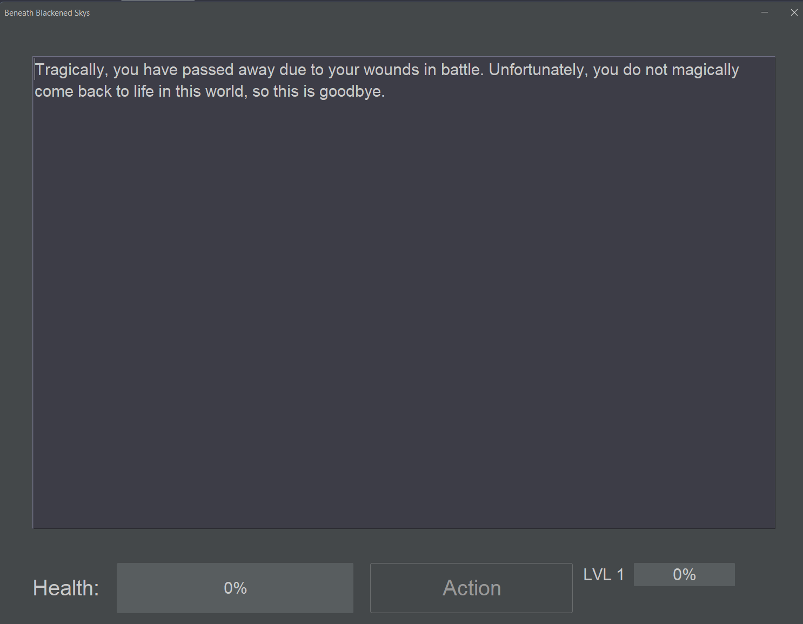
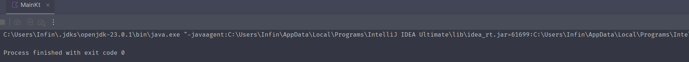

On my first attempt to complete the game, I quickly ran into a problem, where the cooldown map isnt cleared at the end
of combat, causing a soft lock.

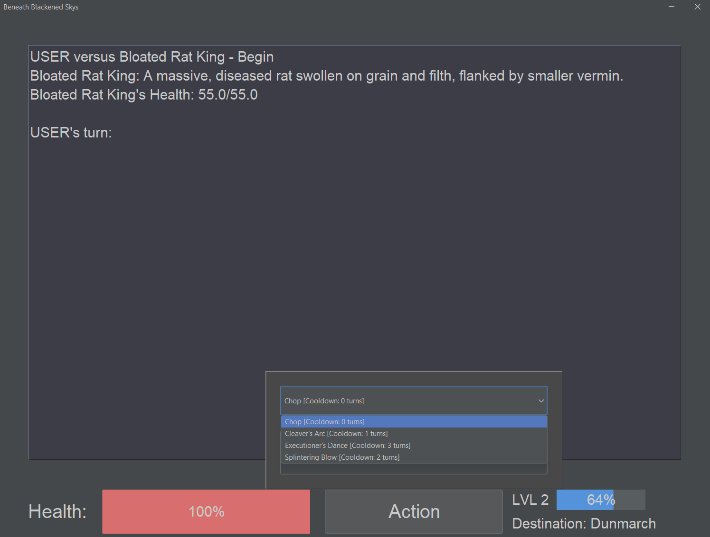

I also noticed the pathfinding was returning empty paths, but since it wasn't game-breaking, I'll cover this in the
Directional Pathfinding test. (Paths where only one move is needed seemed to work however)

As I got to Ironhold later in the story, the sequence didn't trigger, as a ! was missing from the condition to trigger
the sequence. I quickly fixed this and restarted.

After a bit of tweaking the exponential function for maxHealth (originally, you would end up with a ridiculous amount of
health), I managed to defeat the Drowned King.

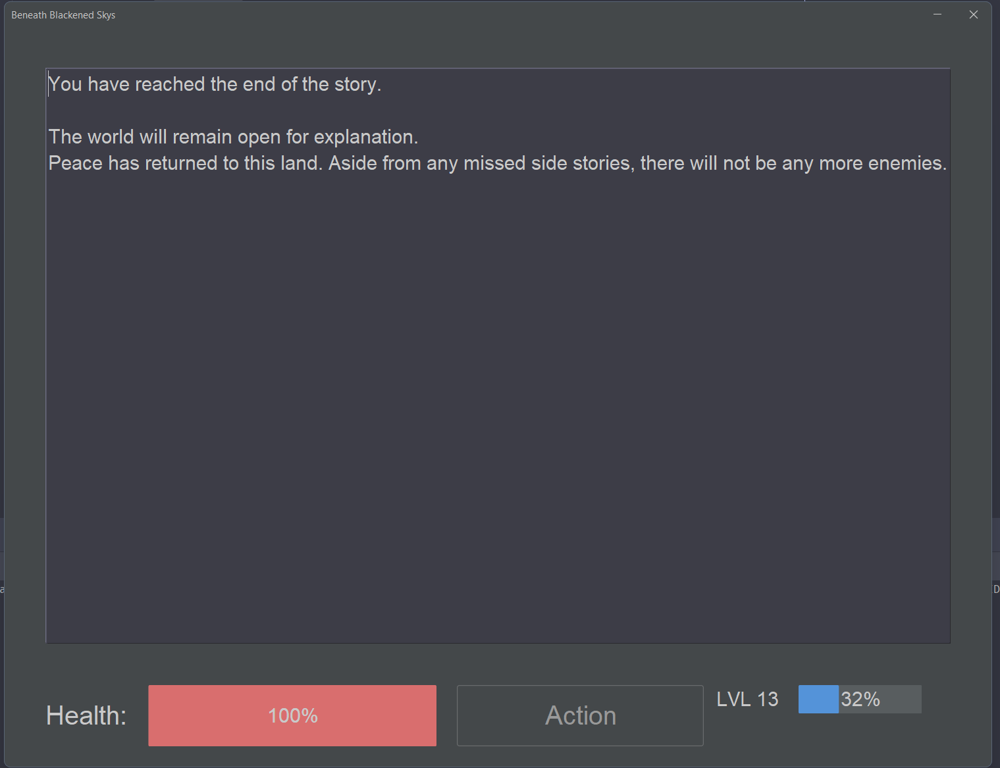

### Test Result

After a couple of bug fixes, I was able to pass the test, proving the game is playable.

---

## Directional Pathfinding

To test the directional pathfinding system, I completed the Northbury chapter to see if the path created was the
shortest.

I also tested the Cinderholm chapter to see if the path between Cinderholm and Thornfall worked, as they are adjacent on
the map.

### Test Data Used

Completing the Northbury chapter, the path to Dunmarch failed.

However, the adjacent path from Ironhold to Cinderholm worked fine.

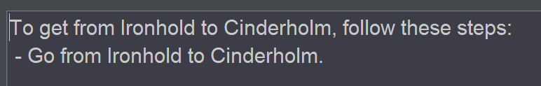

The issue was that instead of adding the neighbour to the queue, I was adding the original node, meaning only adjacent
nodes would resolve a path. After spotting this the longer paths started working again.

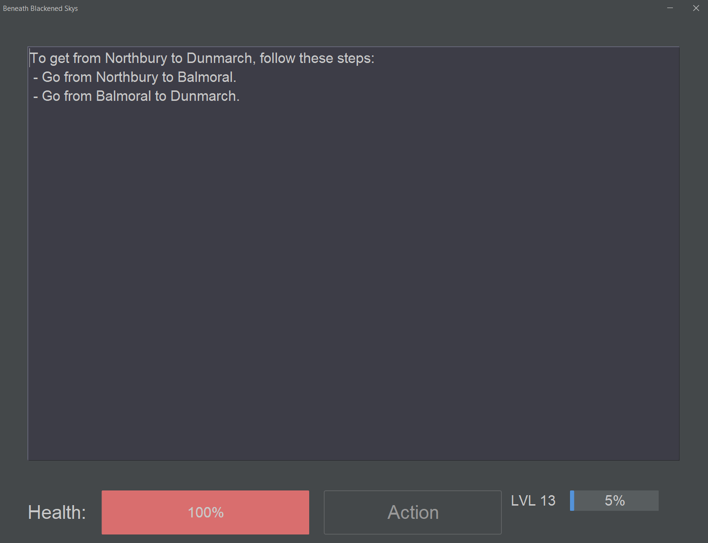

The adjacent path continued working after fixing the algorithm.

### Test Result

Interestingly here, the boundary test is the one that worked, and the standard test failed.
After a quick patch to the pathfinding algorithm, all test cases passed.

---

## Movement System

In this test, I ensured the movement system let me move around the map, and I couldn't make invalid moves.

### Test Data Used

After completing the tutorial, I was able to move to Northbury to continue the story

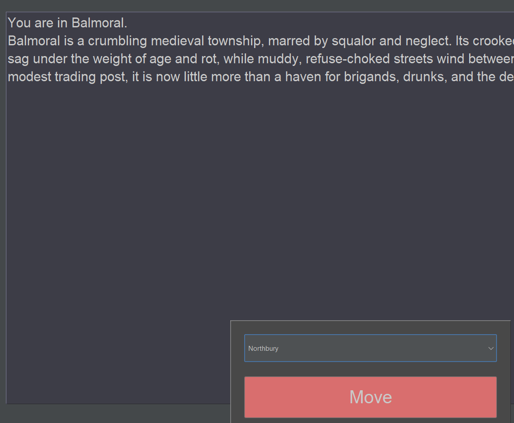

Since JComboBoxes default to the top element, and you cannot select nothing, It is impossible to make an invalid move,
and the code to handle disabling the button is unnecessary. I removed the code handling that as it was no longer needed.

### Test Result

The movement system is indeed working without issue.

---

## Combat System

To test the combat system, I verified you could not use moves on cooldown, and the cooldown worked at the boundary of 1
turns remaining.

### Test Data Used

I was able to use a move not on cooldown against the enemy.

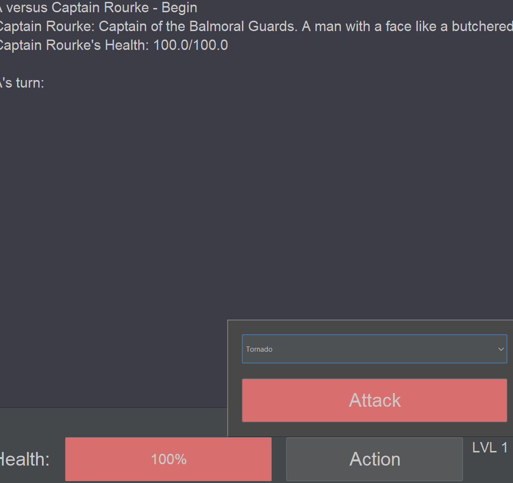

Attacks with one turn of cooldown remaining continued to be treated as invalid.

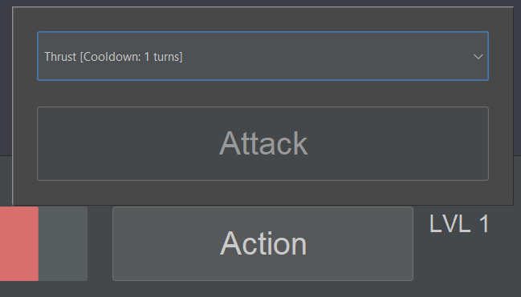

I could use use the basic swing attack twice in a row.

I could not use the powerful attack twice in a row.

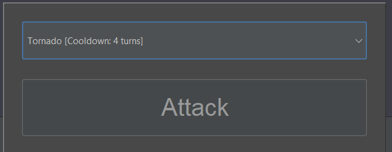

### Test Result

These results align with the expected results, and no modifications were necessary.

---

## Action Button

This test is to ensure the action button can not be used to to something it's not supposed to, as it is dual purpose.
This test is in place to make sure you cannot move on the map during combat, or attack something in free roam.

### Test Data Used

I was able to complete the tutorial and travel to Northbury, meaning both modes are working.

Pressing the action button again would close the menu.

I could not open the action menu when in a sequence (but not in combat), as the button was disabled, in-line with the
expected outcome.

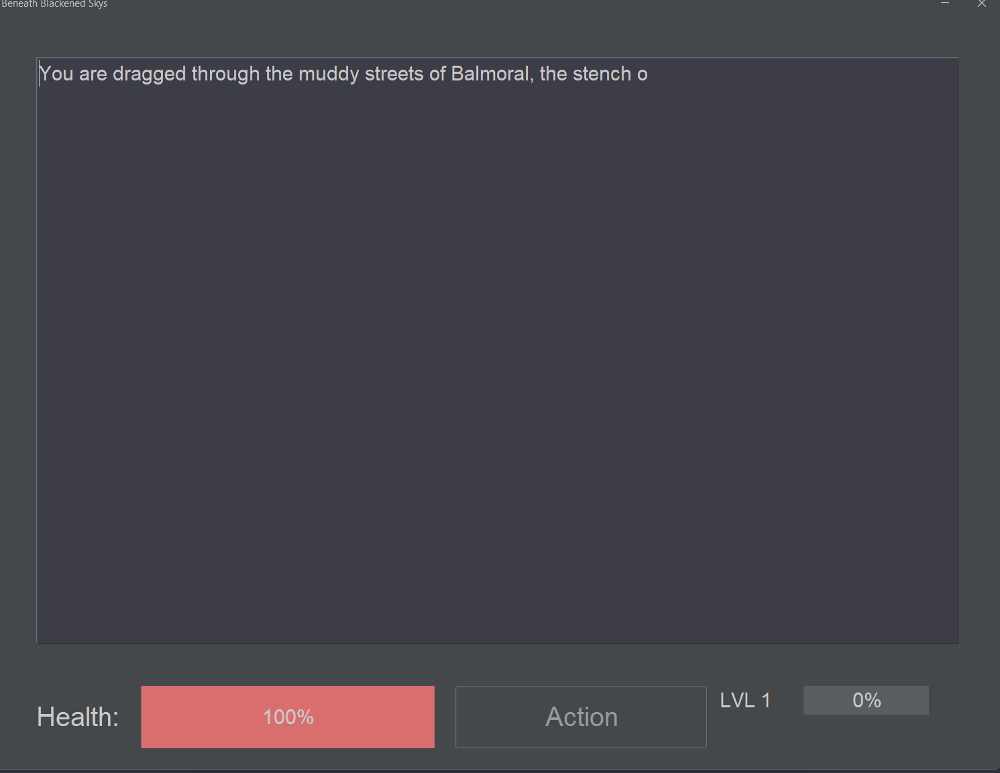

The action button is disabled in combat when the app is not asking for your move, meaning you cannot open it after
defeating your opponent.

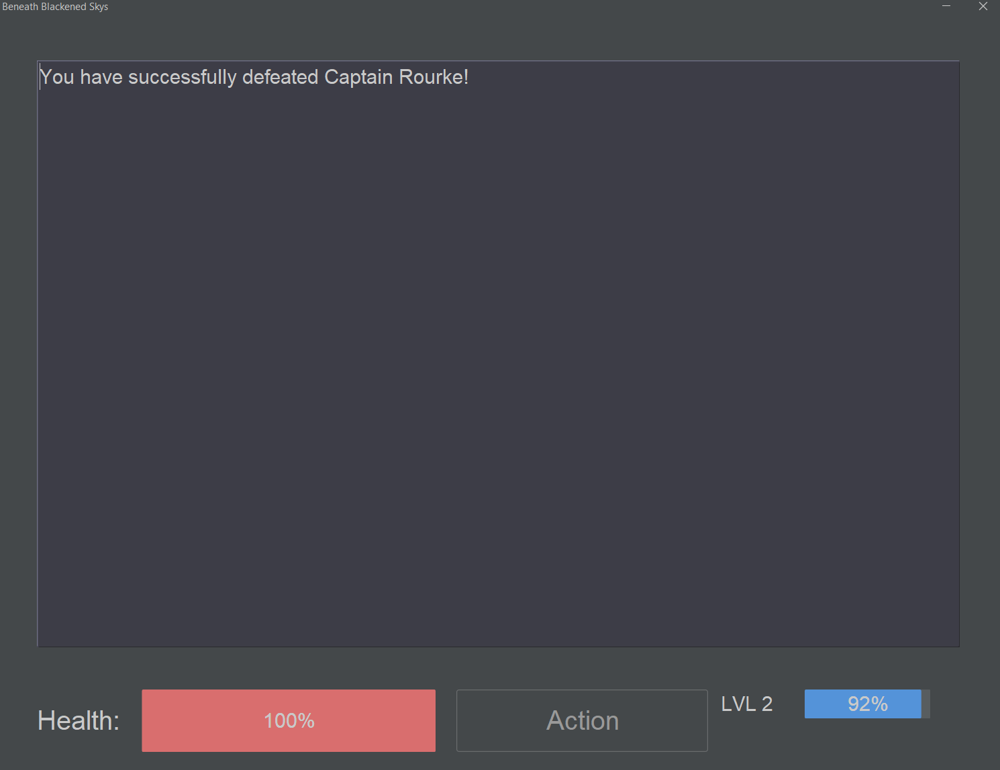

### Test Result

These results align with the expected outcomes, so no changes were necessary.

---